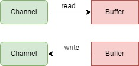
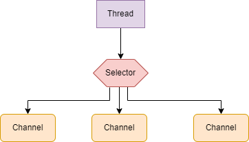

# JAVA NIO

通过上面章节，我们已经了解了I/O的基础概念，了解了Java I/O模型的一个发展过程。这里我们重点学习Java NIO中的一些核心内容的概念以及是如何使用他们的。

主要包括下面三大内容：

- [缓冲区(Buffer)](chapter_2_1.md)
- [通道(Channels)](chapter_2_2.md)
- [选择器(Selectors)](chapter_2_3.md)

在学习上面内容的时候，你必须对Java中的文件操作、套接字、多线程等知识有一定的了解。

## Channels and Buffers

通常的，NIO中所有的IO都是从Channel开始。Channel就好像流一样，可以从Channel中读取数据到Buffer中，也可以从Buffer中写数据到Channel中。
下面是示意图：

[//]: # (图片居中显示，这里注意空行)

NIO中有几种Channel和Buffer的类型。下面是主要的Channel实现列表：

- FileChannel
- DatagramChannel
- SocketChannel
- ServerSocketChannel

如上面这些Channel涵盖了UDP+TCP网络、IO、还有文件IO。

以下是 Java NIO 中核心 Buffer 实现的列表：

* ByteBuffer
* CharBuffer
* DoubleBuffer
* FloatBuffer
* IntBuffer
* LongBuffer
* ShortBuffer

以上这些缓冲区涵盖了您可以通过 IO 发送的基本数据类型：byte、short、int、long、float、double 和 characters。

Java NIO 还有一个 MappedByteBuffer，它与内存映射文件一起使用。

## Selectors

Selector允许用单个线程来处理多个的Channel。如果你的应用需要打开许多的连接（通道），而且每个通道上的流量很低，这会很方便。比如，在聊天服务器中。

下面是Selector处理三个Channel的线程模型：

示意图

