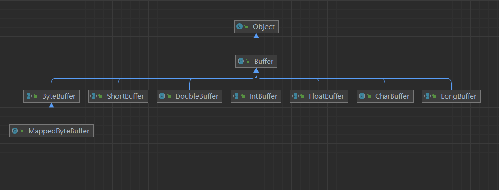

# 缓冲区Buffer

Java NIO中的Buffer用于和NIO中的通道交互。数据可以从通道读入缓冲区，也可以从缓冲区写入到通道之中。

缓冲区本质上就是一块可以写入数据，然后从中读取数据的内存。它被包装成一个NIO Buffer对象，然后提供一些方法来方便的访问该块内存。

下面是缓冲区Buffer的一个家谱图：

如上图，是Buffer的类层次图。在顶部是通用Buffer类。Buffer定义所有缓冲区类型共有的操作，无论是它们所包含的数据类型还是可能具有的特定行为。这一共同点将会成为我们的出发点。

对于每个非布尔原始数据类型都有一个缓冲区类。尽管缓冲区作用于它们存储的原始数据类型，但缓冲区十分倾向于处理字节。非字节缓冲区可以在后台执行从字节或到字节的转换，这取决于缓冲区是如何创建的。

下面是Buffer相关内容章节：

- [缓冲区基础](chapter_2_1_1.md)
- [创建缓冲区](chapter_2_1_2.md)
- [复制缓冲区](chapter_2_1_3.md)
- [字节缓冲区](chapter_2_1_4.md)
